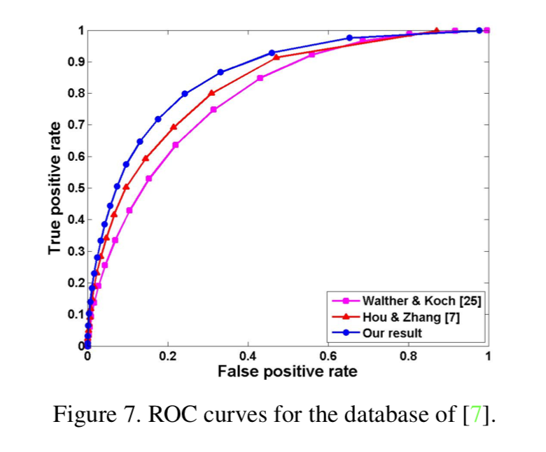

# 论文笔记 - Context-Aware Saliency Detection
> 该论文发表在CVPR 2010

## 亮点
- 该论文将以往的方法进行修改组合，所谓的组合创新。
- 该论文包装的好，文笔很好.....。就比如题目取的，Context Aware （环境感知）的显著性检测，一看就高大上～。

如图：

### 做法
- 多尺度 local-contract 的方法
- 加上和分割后（S>0.8）区域距离的权重，进而包含进部分背景。

### 结果
如图：（一般）～～～～

