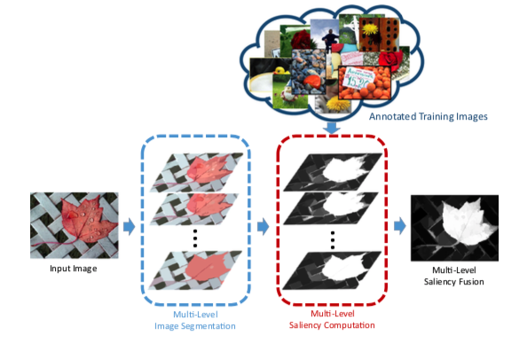
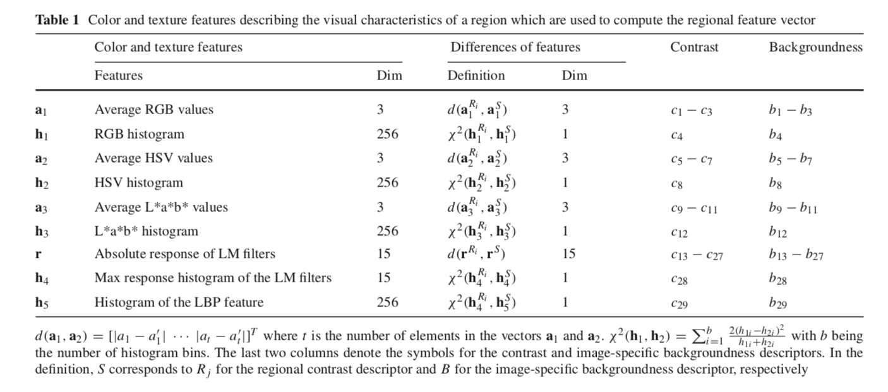
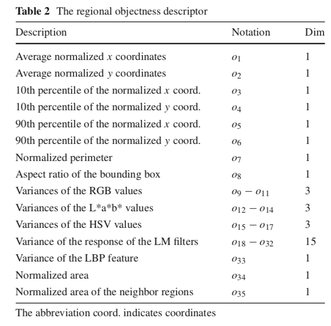
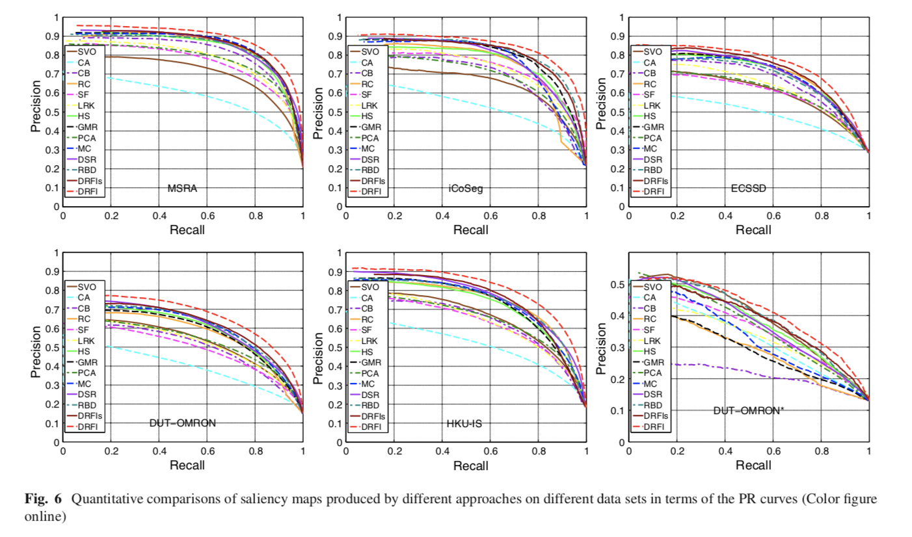

# 论文笔记 - Salient Object Detection A Discriminative Regional Feature Integration
> 该论文发表在CVPR 2013 以及后面又发表在 IJCV 2017

## 亮点
1. 使用随机森林回归器对大量的特征进行集成，并取得多个数据集的SOTA结果。
2. 对于随机森林模型的特征设计，其中包括：region-based contrast描述子，background-based描述子，以及显著性物体描述子。
3. 为了提高模型的表达能力，本论文使用multi-level 的分割，并最后使用linear combination 进行集成。

## 问题
1. 选择的特征
2. 事实证明region-based的方法拥有较好的结果，所以该论文也是region-based。由此，如何去构建训练集的数据和标注。

## 算法
论文算法的总体构架：

#### 1. 构建数据
region-based是使用图像图像分割的方法进行划分相似区域，目前比较常用的方法是SLIC 和graph-base image segmentation等方法。本论文使用是后者。

图像分割所带来的**缺点**：分的太粗，会使得很多区域既包括背景，又包括显著性物体。分的太细，会造成显著性区域的特征不明显。这些都会对训练结果产生影响。

**解决方法**：
简单思路：挑选出正确的纯净的区域(很直观)
- 首先，使用graph-based的分割方法对图像进行过度分割(即区域都是pure)，即为`$S_0$`level。
- 对于相邻区域进行标注(`$R_i$`, `$R_j$`)为`$s(a_i, a_j)$`。根据ground true的进行判断。如果相邻的区域是相同区域，则为1，否则为0。
- 用`$S_0$`提取的数据进行训练boost tree classifier。
- 使用训练好的分类器，对`$S_0$`区域进行合并，并剔除一些评分低的一些区域。把这些区域提取出来，用于后续数据的制作。
- 对提取的区域，提取特征和gt 进行随机森林回归器进行训练。

#### 2. 区域特征提取
- contrast descriptor
如图2，是提取的特征，并进行整合：

```math
x_c = \sum_{R^{'}\in{S_m},R^{'}\neq{R}}\alpha(R^{'})W(p, p^{'})D(v, v^{'})
```
其中，v为图中的特征。`$W(p, p^{'})$`为空间距离。

- backgroundness descriptor

提取图像边缘15个像素区域与其他区域进行对比，特征与上面一样。


- objectness descriptor

如下图3所示，为提取的特征。


#### 3. 结果


