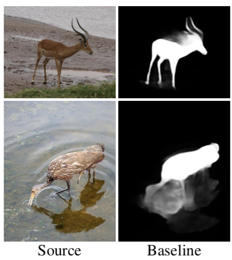
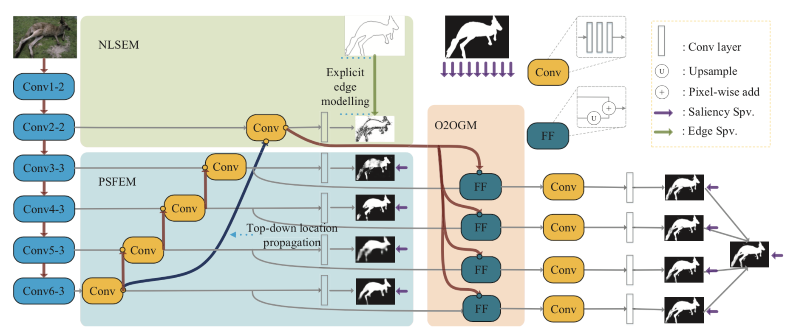
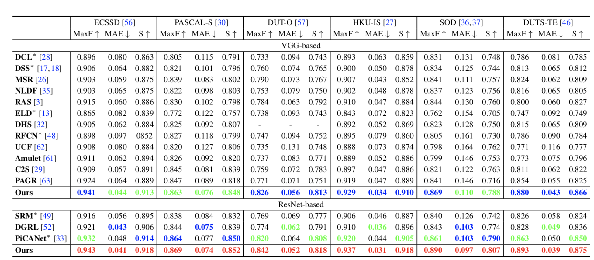

# EGNet: Edge Guidance Network for Salient Object Detection
> 该论文发表在ICCV 2019, 目前这个方法刷新大部分数据集的评价指标。

## Motivation
**问题**：目前，基于全卷积网络(FCNs-based)的显著性检测方法表现优异。但是这种pixel-wise的方法忽略了区域之间的相关性，从而导致显著性物体的边缘会比较粗糙。如下图：

**解决方法**：解决方法比较直观。既然边缘比较粗糙，所以就加入边缘特征(通过Multi-task 训练一个显著性边缘检测器)。

## Network Architecture

该网络框架分为3个部分：显著性边缘特征提取器(NLSEM); 显著性物体特征提取器(PSFEM); 边缘特征指导器(O2OGM)。

论文中使用了两种网络骨架(VGG16, Resnet50)

- 如图所示，其中在Vgg16中去掉FC层,并且加入额外的一层Conv6。并且从中提取出Conv2-2, Conv3-3, Conv4-3, Conv5-3, Conv6-3的特征。其中Conv2-2用于显著性边缘检测(用边缘的map进行监督训练)。
- Conv3-3, Conv4-3, Conv5-3, Conv6-3中的特征进行多尺度特征融合，并在每一路进行训练(用显著性物体进行监督训练)。
- 将边缘检测的特征和每一路物体检测的特征进行融合。后再进行训练(使用显著性物体进行监督训练)

#### loss
从上述可见，有三处进行监督训练，是同时进行训练的。

loss 主要使用cross entropy，并将三个loss进行加和。

## Result

