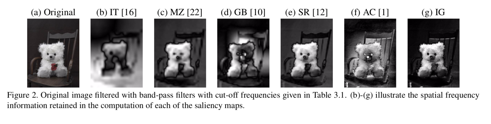
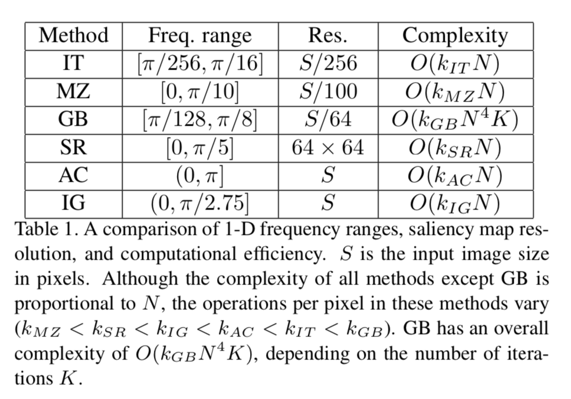
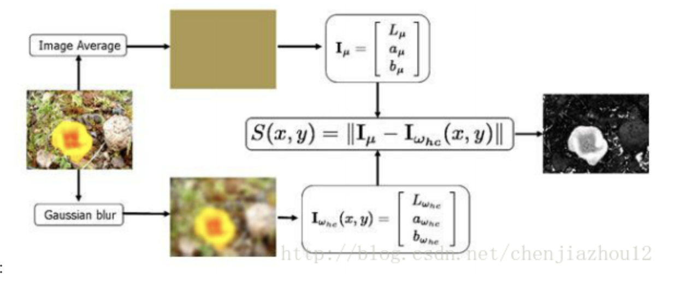
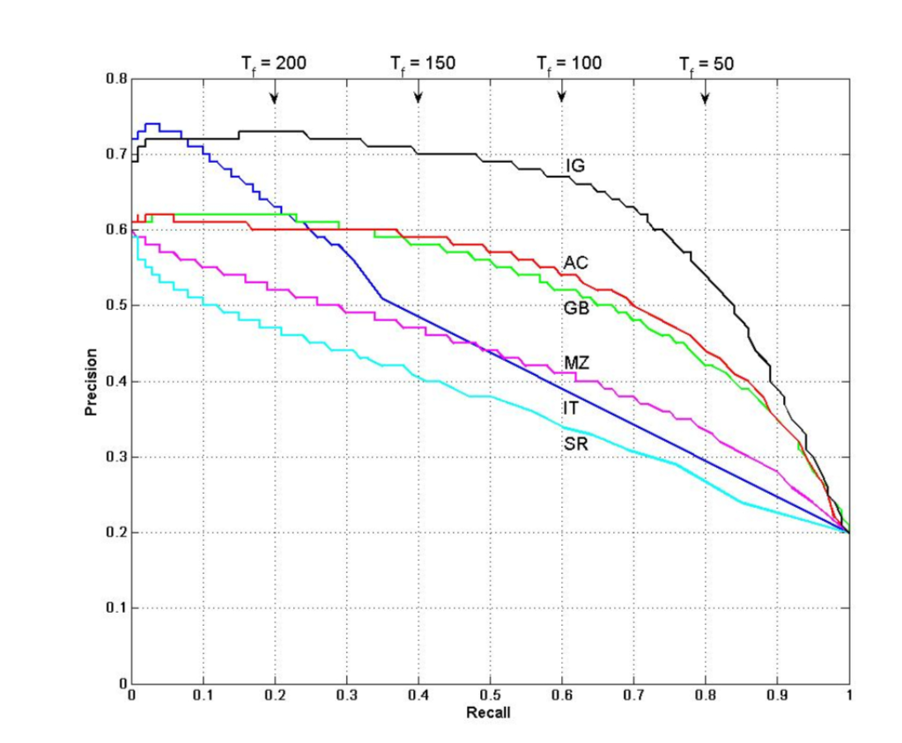
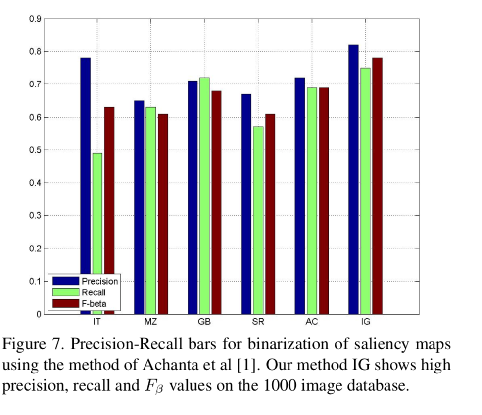

# Frequency-tuned Salient Region Detection
> 该论文发表在CVPR 2009上

## 亮点
- 定义了一种新的物体显著性检测的定义，即将先观注点预测转变成显著物体分割
- 提出新的物体显著性检测的评价方法，使用分割物体的Pricision 和 recall

## 论文主要内容
该论文通过使用【频域信息】对以往显著性检测方法，并得出以往显著性检测方法的缺点，并引入FT方法。

- 缺点1: 以往的方法都对图像进行downsampling，从而导致无法获得【全像素】的显著图
- 缺点2: 一些方法无法准确定位显著性物体的边界（由于对图像进行downsamping而导致的）；一些方法会highlight边界，这是由于方法保留了较多高频信息。

通过分析各个方法保留下来的频率信息，如图。



所以FT方法应该尽可能保留低频信息，且要过滤掉一些纹理的高频信息，最直观的方法是使用【带通滤波器】DoG。


```math
DoG(x, y) = G(x, y, \sigma_1) - G(x, y, \sigma_2)

其中  \sigma 为高斯滤波的方差。
```
通过简单DoG，可以控制一定的频率通过。显而易见的是，通过多个DoG相加可以随意可控【带宽】。以此可的：

```math
\sum = G(x, y, \sigma\rho^N) - G(x, y, \sigma)
```

所以，FT通过带通滤波，将频率信息控制在`$(0，\pi/2.75]$`，其主要流程如下图：


### 评价方法
> 通过度量物体分割的好坏进而判断显著性检测方法的好坏

#### 通过固定分割阈值进行评价
方法： 通过从对显著图的显著值从`[0, 255]`进行变化，从而得到显著性物体的分割区域，进而计算结果的精确度和召回率，如图：


#### 通过自适应的方法获得分割阈值，进而进行评价
本文选取2倍的平均显著值的方法，如下式：

```math
T_a = 2/(W \times H)\sum_{x=0}^{W-1}{\sum_{y=0}^{H-1}{S(s, y)}}
```

结果如下图：



