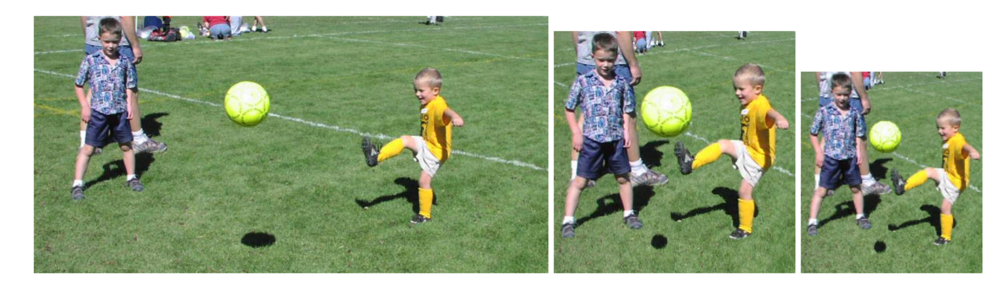
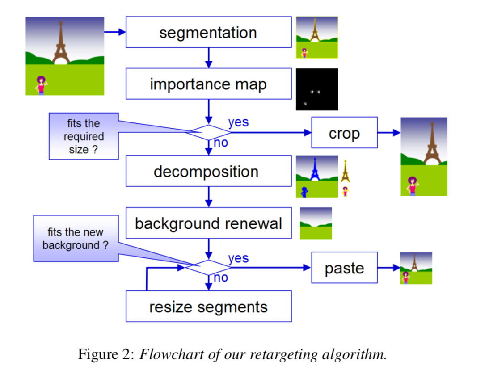
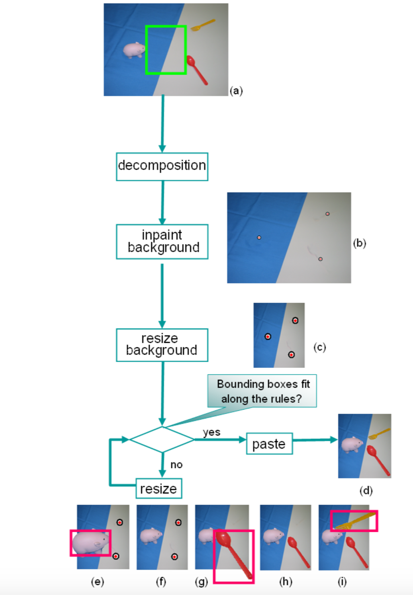

# 论文笔记：Automatic Image Retargeting
> 该论文发表在MUN 2005 上。

### 解决的问题(Motivation)

图像裁剪时，由于图像中两个显著性物体分得比较开，使得无法裁剪，如上左图所示。所以遇到这样的图，只能进行“粗暴”地resizing

本文提出图像重定向的方法来解决上面的问题,图上中图所示。

首要问题是：检测出显著性区域/物体，后进行重定向

### 算法框架
如图：

我们的算法也可以借助这个算法框架。

借助以下方法：
- 显著图检测（需要截取出来）
- Inpainting 算法来恢复截取的区域
- 将截取显著区域pasting 到图像中

pasting 算法步骤：

