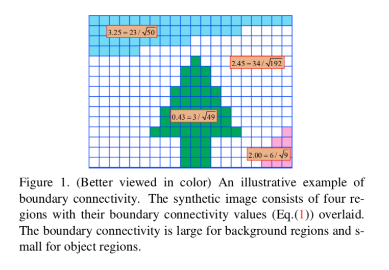
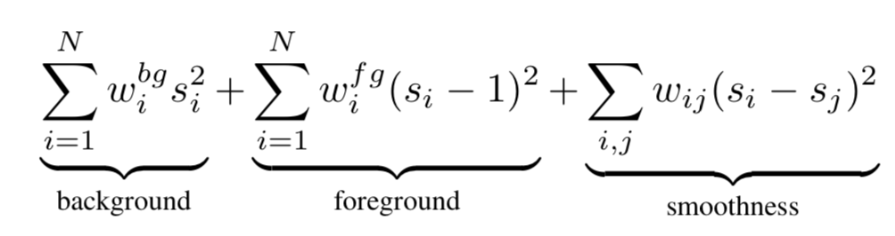
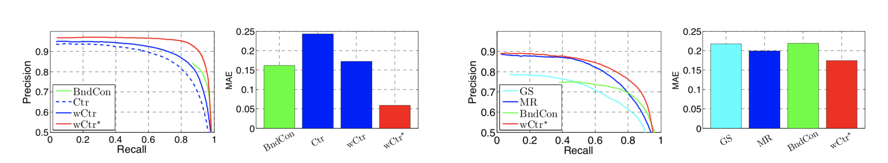

# 论文笔记 - Saliency Optimization from Robust Background Detection
> 该论文发表在CVPR 2014

## 亮点
目前显著性检测从contrast-based 到 background-based进行演变。本论文针对目前的background-based 进行改良，并得到很好的结果。

提出一种基于集成多种显著性检测结果的方法，即ensemble 的方法

## 算法
前面的background-based是简单地使用图像边缘的一定区域进行作为背景区域。但是这样的硬性规定肯定不准确。如何去定义boundary是比较重要的问题，该算法的主要流程如下所示：

1. 首先，对图像进行分割，使用slic的方法。从而形成超像素区域。
2. 定义background区域，以及如何依靠定义的background区域区分saliency region 和 background region。

&emsp; a) 定义一个boundary-connection的值，如图所示，即边缘区域占总区域的多少(周长/面积)。通过这样的定义可以解决显著性物体部分与边缘接触的情况。
```math
BndCon(R) = \frac{|\{p|p\in R, p\in Bnd\}|}{(\sqrt{p|p \in R})}
```
&emsp; b) 但是上式如何进行计算是一个问题，所以如何去计算所谓的周长和面积最重要的问题

3. BndCon的计算

&emsp; a) 面积：

```math
Area(p) = \sum_{i=1}^{N}{exp(-\frac{d^2_{geo}(p, p_i)}{2\sigma^2_{clr}})} = \sum_{i=1}^{N}{S(p, p_i)}
```
其中`$d_{geo}$`为slic中两个超像素区域的lab颜色空间的最短路径的距离和, 即：

```math
d_{geo}(p, p_i) = \min_{p_1=p, p_2,...,p_n=q}\sum_{i=1}^{n-1}{d_{app}(p_i, p_{i+1})}
```
其中`$d_{app}$`为lab空间的欧式距离。

上式可看，Area是计算相似区域的面积大小，如果`$d_{geo}=0$`,则表示全图为均匀区域，面积为1。

&emsp; b) 周长

```math
Len_{bnd}(p) = \sum_{i=1}^{N}{S(p, p_i)} * 1(p_i \in Bnd)
```
即计算与边缘区域的距离，与边缘相近(包括空间距离和颜色相似度) 则Len 越大。

&emsp; c) finally

```math
BndCon(p) = \frac{Len_{bnd}(p)}{\sqrt{Area(p)}}
```
4. 计算显著图

```math
wCtr(p) = \sum_{i=1}^{N}{d_{app}(p, p_i)}w_{spa}w_i^{bg}
```
其中`$w_{spa}$`为空间距离的权重，`$w_{i}^{bg}$`为background-based的权重

```math
w_{spa}(p, p_i) = exp(-\frac{d^2_{spa}(p, p_i)}{2\sigma_{spa}^2})
```
其中`$d_{spa}$`为像素块的位置的空间距离

```math
w_i^{bg} = 1 - exp(-\frac{BndCon^2(p_i)}{2\sigma^2_{bndCon}})
```

5. 集成并求最优解


## 结果


    
