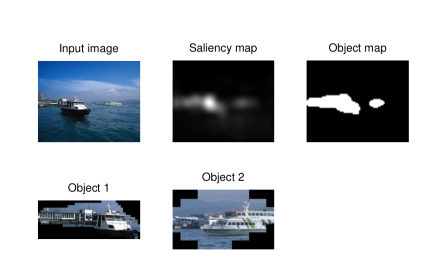

# 论文笔记：Saliency Detection - A Spectral Residual Approach
> 该论文发表在CVPR 2007上, 利用简单的方法对显著性进行检测

### 论文思路来源
早期的显著性检测的首要问题是先要定义(或提出假设)：显著性是什么。

Itti 使用 center-surround contrast 定义显著性...

本文中作者“Spectral Residual Model” 来定义显著性，即：

```math
H(Image) = H(Innovation) + H(Prior knowledge)
```
其中，
```math
H(Innovation)为新奇的部分，即显著点/区域


H(Prior knowledge)为冗余部分，即背景
```
所以，为了得到显著区域，只要将图片减去背景信息，就可获得。

而根据尺度不变理论中的1/f定律，在自然图像中，图像频率谱图中 振幅和频率成反比：

```math
E[A(f)] \propto 1 / f
```
且，无数张自然图片的振幅-频率图最后呈现一定趋势，如图：


### 算法步骤
- 获取图像幅值图:

```math
\mathbb{A}(f)= 
\Re(\xi(\mathbb{I}(x)))
```
- 获取图像相位图：

```math
\mathbb{P}
(f) = \Im(\xi(\mathbb{I}(x)))
```
- log 幅值图

```math
\mathbb{L}(f) = log(\mathbb{A}(x))
```
- 对图形进行平均滤波充当背景谱图，原谱图与背景谱图相减得到Residual 谱图

```math
\mathbb{R}(f) = \mathbb{L}(f) - h_n(f)*\mathbb{L}(f)
```
- 对Residual 谱图进行逆傅立叶变换就可以得到显著性谱图

```math
S(x) = g(x)*\xi^{-1}[(exp(\mathbb{R}(f)+\mathbb{P}(f)))]^2
```
### 算法结果


