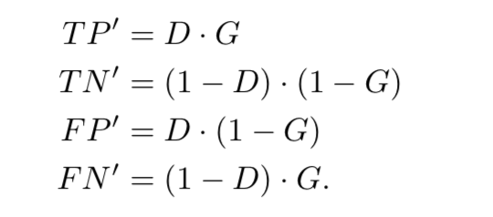
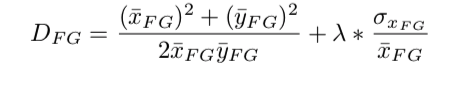
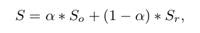

# Saliency Detection Evalution Methods Review
> 对物体显著性检测方法的评价方法进行一个全面的综述，其中包括经典的F measures, MAE, AP Curve, ROC/AUC。以及还包括近几年的发表的方法：

> 1. How to Evaluate Foreground Maps? - CVPR 2014
> 2. Structure-measure- A new way to evaluate foreground maps - CVPR 2017
> 3. Enhanced-alignment Measure for Binary Foreground Map Evaluation - IJCAI 2018

## Introduction
物体显著性检测可以看成是一个pixel-wise的二分类问题，这个是物体显著性检测与图像分割的一个区别。正是由于显著性检测是一个二分类问题，所以算法的输出是一个概率值，之后通过设定一个阈值，来进行硬性划分显著性区域。

所以，评价方法还可以分为: binary-map 评价方法和non-binary-map 评价方法。

## Methods
#### 1. F measure
binary-map的方法，当然也是可以用在non-binary-map。

其中通常取`$\beta^2=0.3$`。

#### 2. PASCAL measure
使用领域也是binary-map, F measure 没有考虑TN项，所以这边加入了TN项

#### 3. MAE
预测的结果是non-binary-map，也是为了解决F measure 没有考虑TN 项的缺点，pixel-wise的绝对值差距。

#### 4. AP Curve
通过设置0-255，步长为1的阈值，对non-binary预测的结果进行分割成binary-map。并进行计算精准度和召回率，然后进行绘制曲线。

#### 5. ROC/AUC
计算方法与PR曲线的计算方法相同，不同的在于ROC曲线是使用真阳率 假阳率。

#### 6. Fwb measure
> How to Evaluate Foreground Maps? - CVPR 2014
- Motivation

总结了经典方法的缺点：
1. Interpolation flaw

对于上图所示，a,b 两者的AP AUC的方法是没有区别的，但是这个是不对的。
2. Dependency flaw

经典方法中忽略不同区域或者相同区域像素点之间的相关性，所以导致上述问题。

3. Equal-importance flaw

对于不同位置的错误应该有不同的权重

- 解决方法

针对与Interpolation flaw, 是由于TP, FP, FN, TN 的计算方法是硬性的。所以使用non-binary map 进行计算TP FP FN TN

对于Dependency flaw 和 equal-importance flaw, 使用不同的权重进行约束解决。将上式转换成error的表达式。

对不同区域附上不同的权重，A和B

其中A 和 B 为：
A：在foreground区域的预测加上了空间距离的约束

B：在background区域加上与gt区域的约束，从而增加在FP区域的误差值。

最后，通过F-measure 使用TPw计算，即为Fwb。

- Meta-Measures

**“如何验证设计的评价指标是否合理”** 是一个比较困难的问题，这边使用了Meta-measures的概念对评价指标进行评判。
    
    1. Application Ranking
    使用应用(Application)来验证评价指标对于不同算法产生foreground的排序是否合理。其中Apps可以是图像检索，物体检测，图像分割等。方法如下图所示：通过预测的foreground与GT的相似度进行ranking。

    
    2. SOTA vs Generic
    使用高斯核产生的显著区域与SOTA方法产生的区域进行平方ranking。并计算错误排序率
    
    3. Ground-truth switch
    对于一张图像，使用一个正确的ground truth 和一个错误的ground truth，并对其进行评分排序。同样计算排序错误率
    
    4. Annotations errors
    通过对ground truth 的形态操作(膨胀等)。操作步骤与上述相同。但是该方法后续验证是不正确的。

#### 7. S-measure (Structure measure)
> Structure-measure- A new way to evaluate foreground maps - CVPR 2017

- Motivation

对于Fbw以及经典的评价方法，都是pixel-wise的评价，忽略了foreground map 的结构信息，对于预测的foreground map具有较完整的结构应该具有较大的评价值。

- Solution

论文提出了使用region-aware 和 object-aware 两项进行衡量。

**region-aware**

借助图像质量评估领域中使用的方法Structural similarity measure(SSIM)。式子如下所示：

其中第一项为亮度相似度，第二项为对比对的相似度，第三项为结构的相似度，由向量`$(x-\hat x)/\sigma_x$` 和 `$(y-\hat y)/\sigma_y$`的相似度，x为map的向量表示，减去亮度和对比度的干扰，即为两个图像向量表示的相似度。

值得一提的是，作者将图像区域划分为4份(通过foreground 的中心划分)分布计算后加权求和

**object-aware**

分别按照下式计算foreground map 和 background map 与 ground truth的相似度。之后进行求和。

上式可知，使用non-binary map的foreground计算与gt的foreground的全局相似度(物体相似度)

最后计算评价值：

- Mate-Measuers

#### E-Measure
> Enhanced-alignment Measure for Binary Foreground Map Evaluation - IJCAI 2018

- Motivation

已经发表的评价方法，要么是pixel-based的评价方式，要么是image-level(S-measure)的评价方法。pixel-level忽略了全局结构性，目前image-level，即s-measure只能使用在non-binary map 中。更为重要的是，视觉系统是包含了pixel-level和image-level的信息。所以本论文是结合了两种不同的方法。

- Solution

作者提出的解决方法比较简单直观，如下图所示：

    1. 首先，计算GT和FM图的均值(image-level信息)；
    2. 然后，GT和FM减去相应的均值,可以看成是中心化的操作。从而考虑进去了pixel-level和image-level的信息，得到`$\phi_FM$`
    3. 再然后，计算pixel-wise的相关性；从而进行对齐，如果符号相同，这为正，反之为负。

    4. 最后使用二次函数进行增强其对齐值，进行求评价即为评价值
