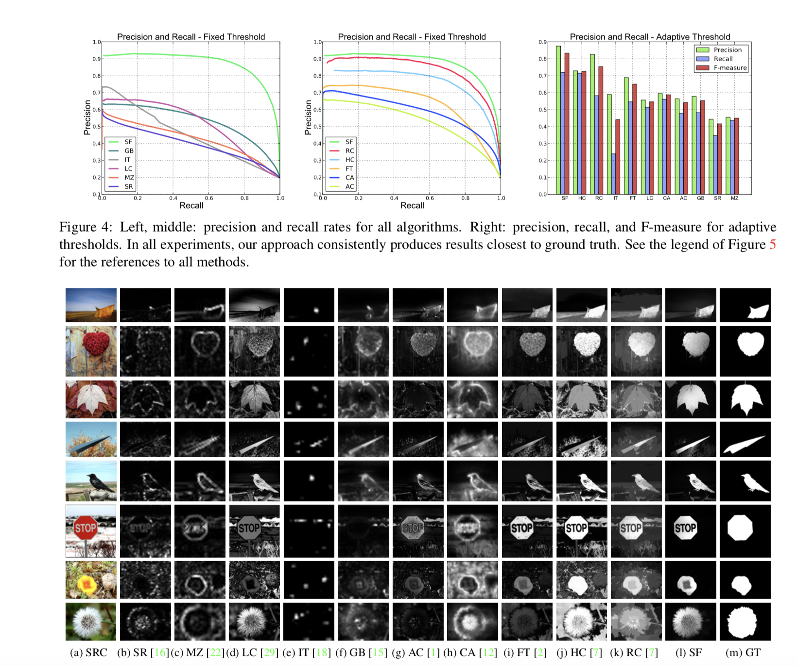

# 论文笔记 - Saliency Filters : Contrast Based Filtering for Salient Region Detection
> 该论文发表在CVPR 2013

## 亮点
- 论文利用[permutohedral lattice]方法（该方法可以以线性时间复杂度解高维高斯滤波），提出了快速的显著性检测方法
- 论文提出了提取图像abtraction，即使用超分辨的方法对图像提取出特征均匀的小区域（不规则），即SLIC（以K-means为基础）

> 其实到目前为止，提取图像显著性区域的方法总结为：如何定义图像显著性。其方法基本是依赖与图像像素/块/区域之间的contrast。大部分方法属于 “拍脑瓜子”想出来的（——程明明）。

## 论文算法
- 该算法主要分为4个大步骤，1. 提取图像的abtraction。 2. 提取出独特的区域（显著性）3. 引入图像空间分布的限制。4. 计算显著值
1. 使用SLIC方法提取图像中 分布均匀的块/区域。SLIC方法是基于k-means：a) 设定k个聚类中心；b)在图像区域均匀分布的初始化聚类中心；c)根据初始化中心区域的梯度进行首次更新聚类中心(避免初始化中心在边缘位置); d)对特征进行迭代更新聚类中心
2. 对提取出的区域计算contrast。使用global-contrast：

```math
U_i = \sum_{j=1}^{N}||c_i - cj|| * w(p_i, p_j)
```
其中`$c_i$`为分割区域i的CIELab颜色空间特征值。`$p_i$` 为区域i 的空间位置。其中`$w_{i,j}^{(p)} = w(p_i, p_j)$`,`$w_{i,j}^{(p)}$`为高斯函数。

上式分解可得：

```math
U_i = c_i^2 * \sum_{j=1}^{N}w_{i,j}^{(p)} - 2c_i\sum_{j=1}^{N}c_jw_{i,j}^{(p)} + \sum_{j=1}^{N}c_j^2w_{i,j}^{(p)}
```
可见：

第一项：`$c_i^2 * \sum_{j=1}^{N}w_{i,j}^{(p)}=c_i^2$`, 因为高斯函数的积分为1。

第二项：`$\sum_{j=1}^{N}c_jw_{i,j}^{(p)}$` 为`$c_j$`的高斯模糊（卷积）

第三项：`$\sum_{j=1}^{N}c_j^2w_{i,j}^{(p)}$`为对`$c_j^2$`的高斯模糊

总：通过在global-contrast中添加高斯函数，经过简单的分解，并且利用快速高斯滤波将计算时间复杂度降为O(n)。

3. 计算图像区域的空间分布

```math
D_i = \sum_{j=1}^{N} ||p_j-\mu_i||^2w(c_i, c_j)
```
其中`$w_{i,j}^{(c)} = w(c_i, c_j)$`,定义颜色特征的相识度。`$\mu_i=\sum_{j=1}^{N}w_{i,j}^{(c)}p_j$`，表示`$c_i$`区域对位置的权重均值。

通过分解，依然可以将其优化成线性时间复杂度。

4. 计算最后的显著值

首先计算分割的每个区域的显著值：
```math
S_i = U_i* exp(-k*D_k)
```

最后为图像的每个像素分配显著值：

```math
\hat{S}_i = \sum_{j=1}^{N} w_{i,j}S_i
```
中`$w_{i,j} = 1/Z * exp(-1/2(\alpha||c_i - cj|| + \beta||p_i-p_j||)）$`。综合考虑位置和颜色特征。为上采样时提供足够的视野。

## 结果


## 评价
除了使用precision - recall 曲线，作者使用Mean Absolute Error(MAE)进行度量。

其原因为，precision-recall 没有考虑True Nagtive 这一项，即对于正确预测背景区域，没有进行考虑。而MAE进行了度量：

```math
MAE = \frac1{W * H} \sum_{x=1}^{W}\sum_{y=1}^{H}|S(x, y) - GT(x, y)|
```


